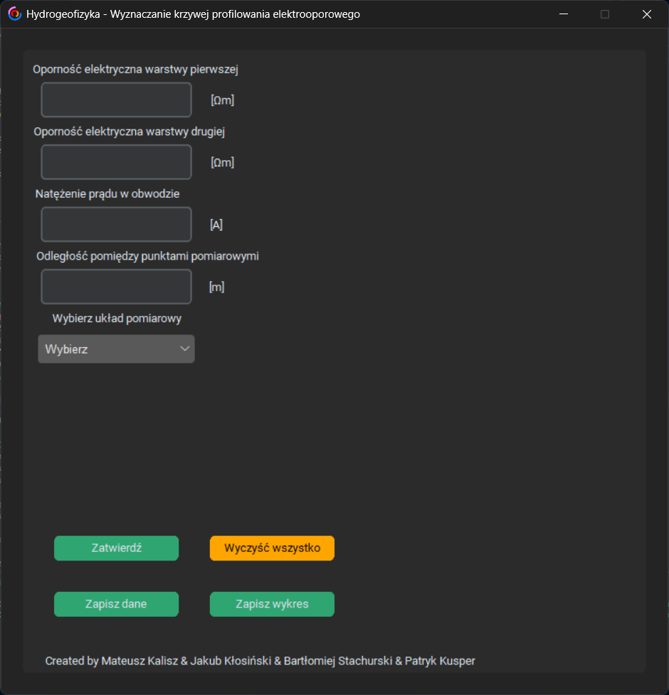
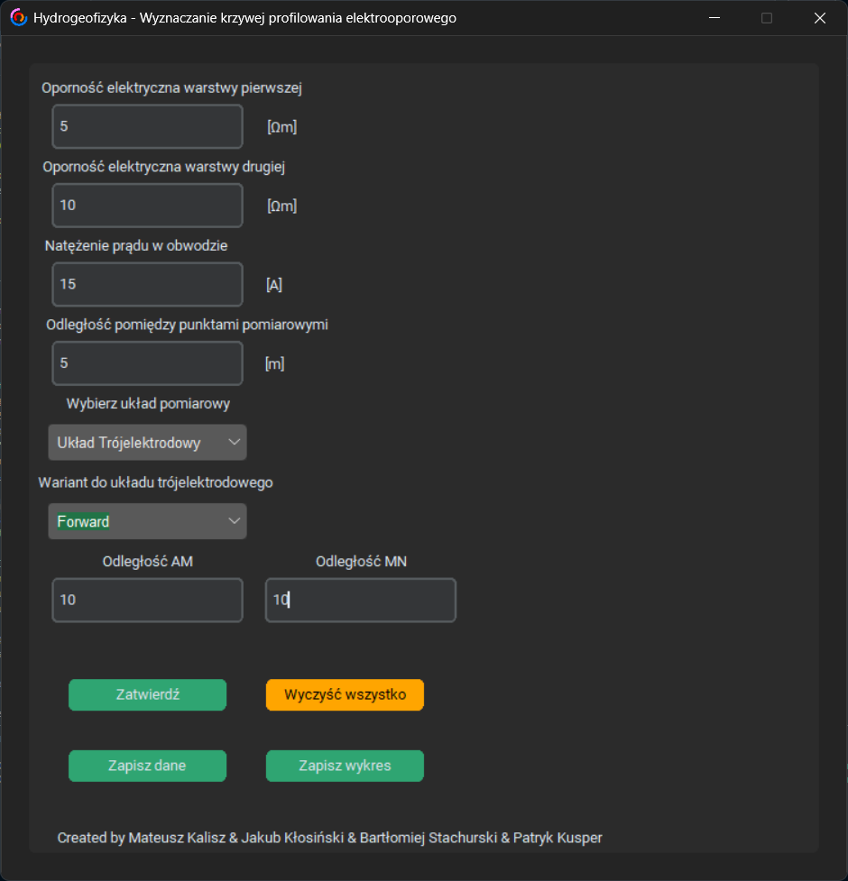
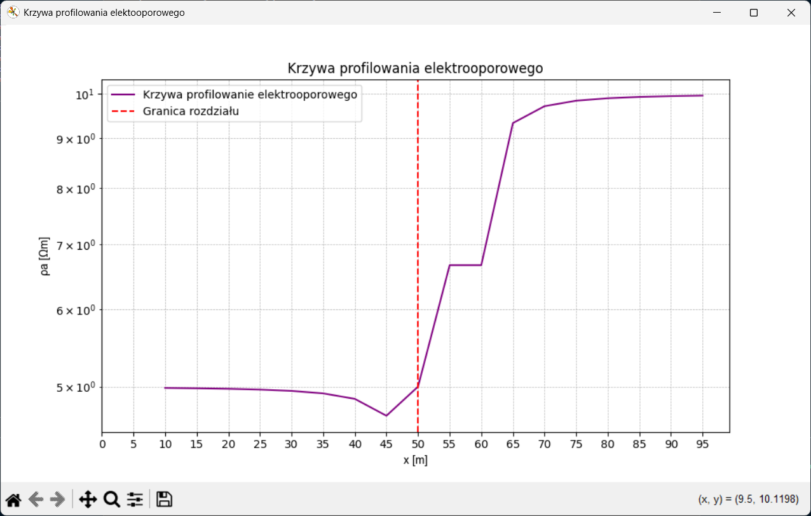

# Mesurment Curve Visualization

A Python-based desktop application for calculating and visualizing apparent electrical resistivity curves used in hydrogeophysical profiling. The tool enables analysis of subsurface layer structures using common electrode configurations and provides exportable results for further interpretation. Build as a project on Hydrogeophisics class in 4 people team: @pstryk1, @Matthew-Calish, @jacobkls and me @Bartuniooo. <br> <br>
**All rights reserved for authors ©**

---

## 🚀 Features

- 📊 Calculates **apparent electrical resistivity (ρa)** based on measurement data.
- 🧮 Supports three electrode configurations:
  - Wenner array
  - Schlumberger array
  - Three-electrode array (Forward / Backward)
- 📈 Automatic generation of resistivity profiling curves (logarithmic scale).
- 💾 Export options:
  - save computed data to `.txt`
  - save plots to `.png`
- 🧪 Input validation with visual error highlighting.
- 🖥 User-friendly GUI built with CustomTkinter.
- 🧹 One-click clearing of all input fields.

---

## 🧩 How It Works

This application simulates the analysis of electrical resistivity profiling used in hydrogeophysics to investigate subsurface structures.

### Workflow

1. **Input environmental data**
   - soil layer resistivity values
   - current intensity
   - measurement step
   - electrode configuration

2. **Data validation**
   - range checking
   - visual feedback for invalid fields

3. **Computation**
   - `functions.measurement()` calculates apparent resistivity values
   - measurement points (x coordinates) are generated

4. **Visualization**
   - ρa(x) curve plotted on a logarithmic scale
   - layer boundary indicator displayed on the graph

5. **Export results**
   - data → `.txt`
   - plot → `.png`

---

## 🛠 Tech Stack

**Language**

- Python 3

**Libraries**

- `tkinter` – GUI framework
- `customtkinter` – modern UI components
- `matplotlib` – data visualization
- `ttk` – themed widgets
- `re` – input validation

**Project Structure**

- `functions.py` – geophysical calculation logic
- `dataVar.py` – shared data storage
- GUI module – interface handling and validation

---

## 🧠 My contribution and What I learned

In this project, I was responsible for designing and implementing the GUI and handling user input data.

This project improved my skills in developing real-world engineering applications, including:
- building desktop interfaces using Python, Tkinter, and CustomTkinter
- implementing robust input data validation and handling
- mastering Python on real-problem project

---

## ⏩ Demo

<p align="center">
   
   
   
</p>  

---

## 📦 Installation & Running

```bash
git clone https://github.com/Bartuniooo/Mesurment-Curve-Visualization.git
cd Mesurment-Curve-Visualization
python Main.py
```
---

## 👥 Contributors
- @Matthew-Calish
- @jacobkls
- @Bartuniooo
- @pstryk1
